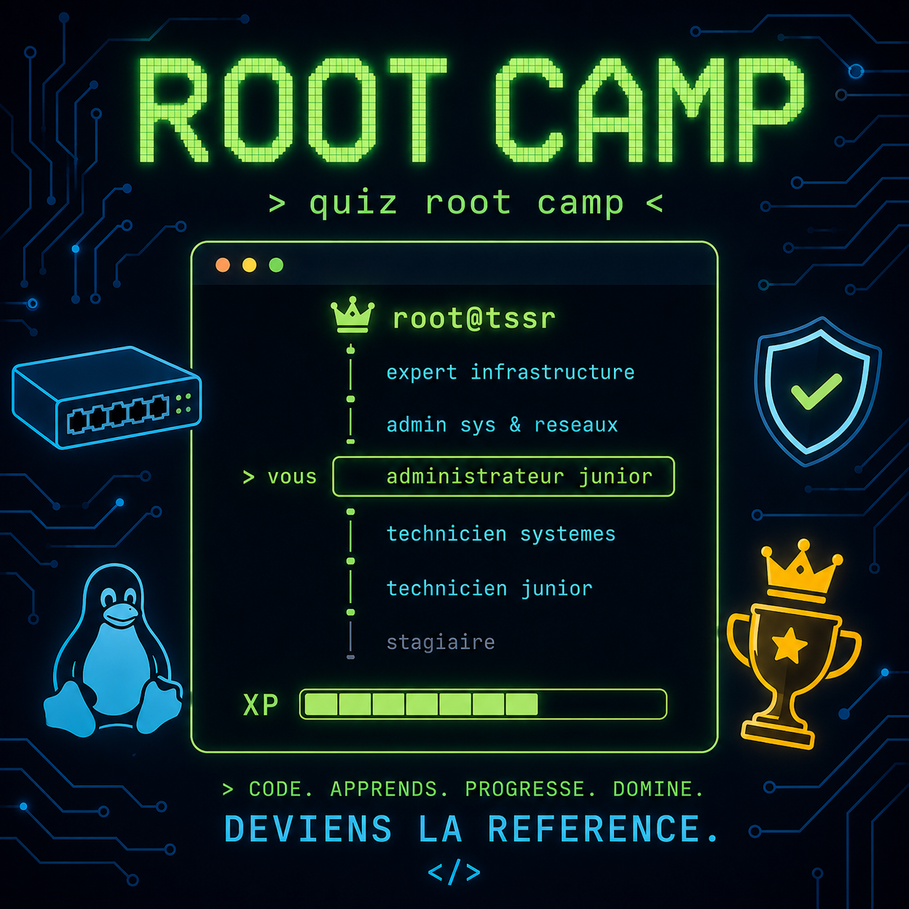
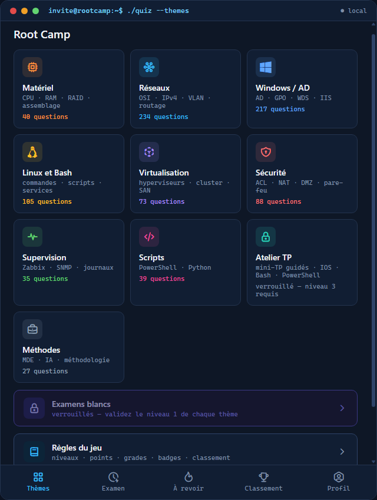
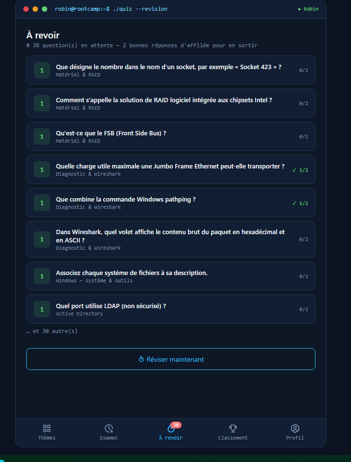
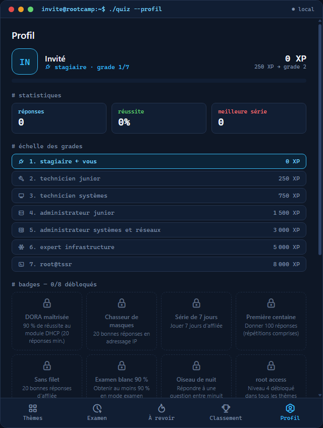
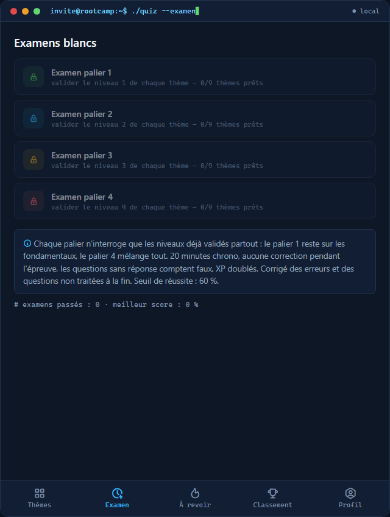
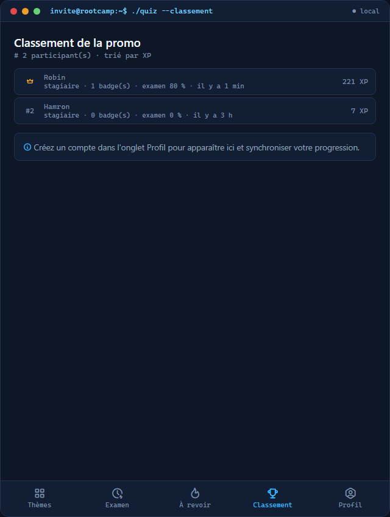
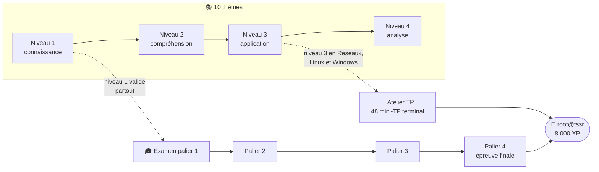
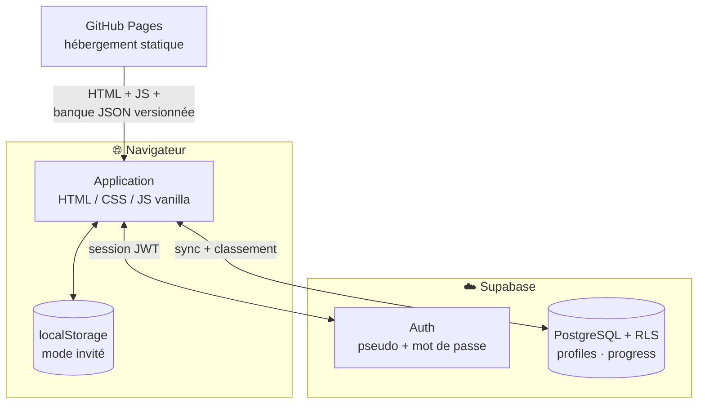

<div align="center">



# 🏕️ Root Camp

**De stagiaire à `root@tssr` — le jeu de révision de la promo TSSR**

[](https://esado95.github.io/root-camp/)


</div>

---

## ✨ Le concept

Réviser le titre professionnel **TSSR** (Technicien Supérieur Systèmes et Réseaux) en jouant :
les cours de la promo sont transformés en **906 questions**, un **terminal simulé** fait taper de
vraies commandes Cisco/Bash/PowerShell, et le **classement de promo** entretient la motivation.
Chaque question corrigée affiche une explication et sa fiche source — on apprend, on ne devine pas.

## 📸 Aperçu

| Accueil | Révision en cours |
|:---:|:---:|
|  |  |

| Profil & grades | Examens à paliers |
|:---:|:---:|
|  |  |

<!-- À ajouter quand les captures seront prêtes :
| Terminal simulé | Classement |
|  |  |
-->

## 🗺️ La progression

Tout se mérite : les niveaux se débloquent à **70 % de réussite**, l'Atelier et les examens
s'ouvrent quand les fondations sont posées.



**7 grades** jalonnent la route : `stagiaire` → `technicien junior` → `technicien systèmes` →
`administrateur junior` → `admin systèmes & réseaux` → `expert infrastructure` → `root@tssr`.

## 🎮 Fonctionnalités

| | |
|---|---|
| 🃏 **8 types de questions** | QCM, choix multiples, association, remise en ordre, champ libre, scénario de panne, terminal, mini-TP guidé |
| 🖥️ **Terminal réaliste** | prompts évolutifs (`Switch#` → `(config-vlan)#`), autocomplétion **Tab**, historique **↑/↓**, marqueur d'erreur `^` aligné comme sur un vrai IOS |
| ⏱️ **Examens blancs** | 4 paliers progressifs, 20 questions / 20 min, aucune fuite d'indice pendant l'épreuve, corrigé complet à la fin |
| 🔁 **Révision espacée** | chaque erreur part en pile « à revoir », sortie après 2 bonnes réponses d'affilée |
| 💾 **Checkpoint** | session sauvegardée à chaque question — on reprend plus tard, même sur un autre appareil |
| 🏆 **Gamification** | XP, 7 grades, 8 badges, classement de promo en temps réel |
| ☁️ **Comptes synchronisés** | pseudo + mot de passe, progression PC ↔ téléphone, mode invité 100 % local |
| ⌨️ **Accessible** | réponses au clavier (1-4 / A-D / Entrée), focus visible, ARIA |

## 🏗️ Architecture

Application **100 % statique** (aucun serveur à maintenir, coût d'infrastructure : 0 €) ;
la partie en ligne repose sur Supabase, sécurisée par Row Level Security.



## 🚀 Lancer en local

```bash
python -m http.server 8123
```

puis ouvrir <http://localhost:8123> — ou simplement double-cliquer `Lancer-le-quiz.bat` sous Windows.
(Un serveur statique est nécessaire : les banques de questions sont chargées en `fetch`.)

## 🧱 Structure

```
index.html                  application monopage
css/style.css               thème « console » sombre
js/app.js                   moteur : sessions, examens, XP, badges, checkpoint
js/online.js                comptes, synchronisation, classement (Supabase)
questions/
├── manifest.json           thèmes + modules + version de la banque
└── <thème>/<module>.json   906 questions réparties en 28 modules
supabase/                   schéma SQL + durcissement (RLS, contraintes)
tools/validate_bank.py      validation structurelle de toute la banque
```

## 🧪 Qualité

- **Validateur automatique** : `python tools/validate_bank.py` — schéma des 8 types, bornes des
  réponses, unicité des 906 identifiants, cohérence du manifest ;
- banque **versionnée** : mise à jour des questions sans vider le cache de personne ;
- questions **sourcées** : chaque explication cite la fiche de cours d'origine.

---

<div align="center">

**Un retour, un bug, une idée de question ?** Ouvrez une issue — la promo améliore le jeu chaque jour. 🛠️

</div>
